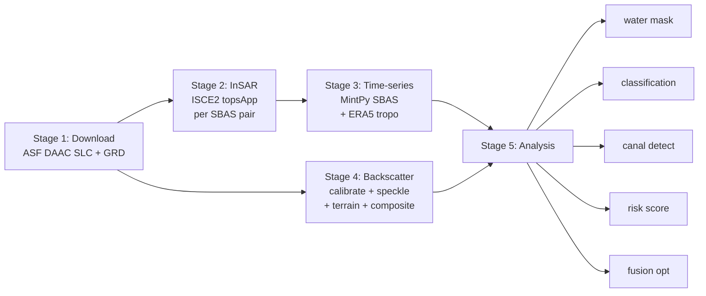
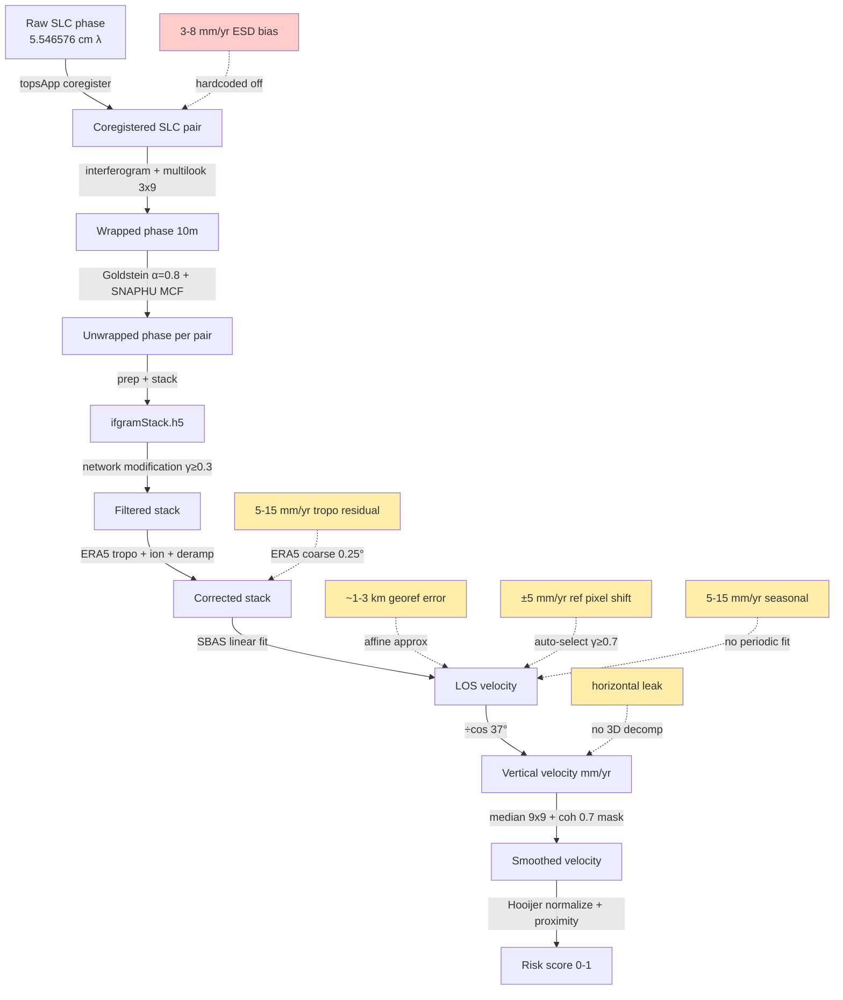
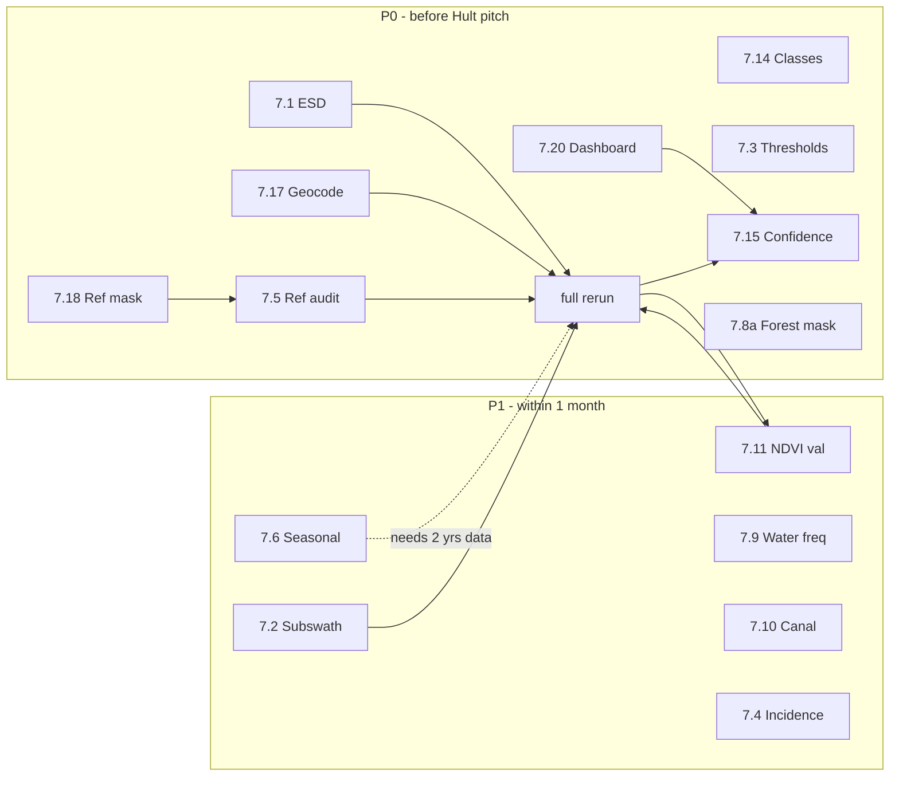

# PeatGuard Methodology Review

> [!abstract]
> This document is an internal technical audit of the PeatGuard v3 peatland subsidence-monitoring
> pipeline as of 2026-04-18. It enumerates the scientific assumptions baked into the code,
> identifies places where those assumptions are thin, and proposes concrete, file-level fixes
> ordered by impact. It is intentionally adversarial: the goal is to poke holes in the current
> plan before a Hult Prize panel or a Verra auditor does it for us.
>
> Audience: Tommy (me), PeatGuard engineering, and anyone inheriting the repo.
> Related: [[pipeline_shortcomings]], [[plans_for_improvement]], [[ALOS2_Application_Draft]].

---

## 1. Goal and Target Output

### 1.1 What we are actually claiming

PeatGuard's output is **not** a scientific subsidence measurement publication. It is a
**restoration-priority decision layer** for Hult Prize judges / NGO partners / (eventually)
Verra MRV. The pipeline ingests Sentinel-1 C-band SAR and — in the multi-sensor branch —
NISAR L-band SAR, and produces five families of raster products for a ~17 km × 11 km AOI
centred on Teluk Bayur Village, West Kalimantan:

| Product family | File(s) | Units | Intended use |
|---|---|---|---|
| Vertical subsidence velocity | `subsidence_velocity.tif`, `..._utm.tif`, `velocity_uncertainty.tif` | mm/yr | Rate of peat loss |
| Temporal coherence | `coherence_median.tif` | 0–1 | Quality mask, land-cover proxy |
| Subsidence classification | `subsidence_class.tif` | 1–5 (severe/active/stable/uplift/water) | Stakeholder maps |
| Canal detection + proximity | `canal_mask.tif`, `canal_distance.tif` | binary, metres | Drainage-influence zones |
| Risk / priority score | `canal_risk_score.tif` | 0–1 | Restoration triage |

The AOI bbox is set in `config/default.yaml` line 10:
`bbox: [114.277, -2.611, 114.431, -2.511]`. ^aoi-bbox

### 1.2 What stakeholders hear

The pitch deck claims "detect ground sinking near drainage canals" and "prioritise where to
block canals for peatland restoration." The risk score is presented as a 0–1 map where
higher is worse. **Stakeholders will read the map as absolute truth.** They will not see
error bars, georeferencing uncertainty, or the fact that our reference point is arbitrary.
Section 6 of this document is almost entirely about that gap.

### 1.3 Target carbon-MRV standard

For Verra VM0036 / VM0048 compliance the pipeline would need:
- Per-pixel uncertainty propagated to tonnes-CO₂/ha/yr
- Independent validation (GPS, LiDAR, piezometer, or peer InSAR)
- Documented reproducibility (fixed code + fixed container + fixed reference point)
- Seasonal decomposition (irreversible subsidence vs. reversible water-table oscillation)

We are currently ~0/4 on these. That is fine for the Hult pitch; it is not fine for
carbon credits and we should be careful not to conflate the two in external comms.

---

## 2. Current Pipeline Architecture

### 2.1 Stage overview



### 2.2 Stage-by-stage (with file anchors)

#### Stage 1 — Data Ingestion
- Entry: `orchestrator.py::run_download_stage` (line 24).
- ASF DAAC search + download of 14 Sentinel-1A IW SLCs and 14 IW GRDs for 2024.
- No quality filter at ingest other than ASF-side metadata. All scenes that match the
  AOI bbox + date range are accepted. ^stage1

#### Stage 2 — InSAR Processing
- Entry: `orchestrator.py::run_insar_stage` (line 62).
- SBAS pair generation in `insar/pairs.py::select_sbas_pairs`, with
  `max_temporal_baseline_days = 48` for both Sentinel-1 and NISAR (default.yaml lines 21, 29).
- Per-pair ISCE2 run via `insar/topsapp.py::process_pair` (line 359), which calls
  `generate_topsapp_config` (line 193) and `run_topsapp` (line 281).
- DEM: Copernicus GLO-30 mosaic from AWS (no auth), `topsapp.py::_download_dem` (line 27).
- Orbits: ESA STEP precise orbits via `ingest/orbit.py::download_orbits_for_pair`.
- Pair working directories are uploaded to GCS immediately after success
  (`orchestrator.py::_upload_pair_to_gcs`, line 246), then deleted locally
  before the next pair starts.
- Pre-cleanup block in `orchestrator.py` lines 330–372 aggressively removes
  SAFE directories and stale ZIPs between pairs. **Local-mode guard**: the ZIP deletion
  (lines 361–372) is now gated on `config.storage.gcs_bucket` being set, so on a laptop
  run we do not delete the authoritative (often read-only) ZIP store. ^stage2

#### Stage 3 — Time-series Inversion
- Entry: `orchestrator.py::run_timeseries_stage` (downstream of Stage 2).
- `timeseries/mintpy_prep.py::prep_data_for_mintpy` (line 515) builds `ifgramStack.h5`
  and `geometryRadar.h5` by directly reading ISCE2 binaries — we do NOT rely on
  MintPy's `prep_isce.py` because the cloud-resumed inputs lack some metadata.
- MintPy config generated by `generate_mintpy_config` (line 379); ERA5 tropospheric
  delay pre-downloaded by `pre_download_era5` (line 227) to avoid the bulk CDS timeout
  that previously killed the pipeline.
- Reference point: from `config.mintpy.reference_lalo` when set, otherwise auto-select
  on highest coherence (lines 411–447).
- `mintpy.geocode = no` (line 137 of `_MINTPY_TEMPLATE`) — geocoding is handled at
  export time by affine approximation. This is a known limitation (see §6.3). ^stage3

#### Stage 4 — Backscatter
- Calibrate GRDs (σ⁰) → Lee Sigma speckle filter → GCP-based terrain correction →
  temporal median composite. Output: `vv_median.tif` and `vv_median_db.tif` in UTM
  Zone 49S (EPSG:32649), 10 m pixel. Runs in parallel with Stage 2. ^stage4

#### Stage 5 — Analysis
- `analysis/water_mask.py` thresholds VV at `-18 dB` (default.yaml line 61) to mask
  rivers and standing water before subsidence classification.
- `analysis/subsidence_class.py` bins velocity into 5 classes (severe / active / stable /
  uplift / water) using the thresholds in `classification:` (default.yaml lines 48–54).
- `analysis/canal_detect.py::detect_canals` (line 280) uses a 10th-percentile VV
  threshold plus morphological cleanup. Sato ridge filter is **disabled** (line 308,
  comment: "Ridge detection was removed because it added too much noise").
- `analysis/risk_score.py::generate_risk_map` (line 106) combines canal proximity
  (linear decay over 1200 m) with subsidence (normalised to −40 mm/yr severe) with
  weights 0.45 / 0.55 from Hooijer 2012.
- Optional coherence-weighted C+L fusion in `analysis/fusion.py` (disabled by default,
  `fusion.enabled: false` at default.yaml line 96). ^stage5

---

## 3. Scientific Basis

### 3.1 InSAR fundamentals we rely on

PeatGuard's velocity is a **line-of-sight (LOS)** phase-derived measurement:

$$
\Delta\phi = \frac{4\pi}{\lambda} \cdot \Delta r_{\text{LOS}} + \phi_{\text{atmo}} + \phi_{\text{topo}} + \phi_{\text{noise}} + \phi_{\text{orbit}} + \phi_{\text{iono}}
$$

For Sentinel-1 C-band, λ = 5.546576 cm (hardcoded in `mintpy_prep.py` line 65).
One phase wrap (2π) corresponds to ~2.77 cm LOS displacement, or ~3.47 cm vertical at
our incidence angle (see §3.3).

Each phase term maps to a processing stage in our pipeline:

| Phase term | Physical source | Handled by | Code reference |
|---|---|---|---|
| $\phi_{\text{topo}}$ | Topographic residual from DEM error | ISCE2 `topsApp::topo` + MintPy DEM-error | `topsapp.py` line 173 `region of interest`; `_MINTPY_TEMPLATE` `topographicResidual = no` |
| $\phi_{\text{atmo}}$ (tropo) | Water vapour + hydrostatic delay | MintPy `correct_troposphere` with PyAPS/ERA5 | `mintpy_prep.py` line 121 |
| $\phi_{\text{iono}}$ | Ionospheric TEC gradients (equatorial) | ISCE2 split-spectrum ionospheric correction | `default.yaml` line 46 `do_ion: true` |
| $\phi_{\text{orbit}}$ | Residual baseline error | MintPy `deramp = linear` | `_MINTPY_TEMPLATE` line 129 |
| $\phi_{\text{noise}}$ | Decorrelation, thermal | Coherence weighting + network modification | `default.yaml` line 131 |
| $\Delta r_{\text{LOS}}$ | **What we want** | SBAS inversion, residual after above | `sbas.py` |

The inversion is only as good as the corrections. Any residual in any of the five
non-deformation terms leaks directly into the velocity estimate.

### 3.2 SBAS inversion

We use Small BAseline Subset (Berardino et al. 2002) inversion via MintPy's
`smallbaselineApp`. The key assumptions:

1. **Linear velocity** over the observation window. Enforced by
   `mintpy.velocity.startDate/endDate = auto` (mintpy_prep.py lines 132–134) —
   a single linear fit to cumulative displacement.
2. **Coherent network**: pair rejection at `mintpy.network.minCoherence = 0.3`
   (default.yaml line 131) and coherence-based network modification enabled (line 130).
3. **Redundant pairs** allow temporal decorrelation / unwrapping errors to average out.
   With our 48-day max baseline and 14 scenes, we generate ~29 pairs, of which only
   ~16 actually unwrap successfully (55% — see §6.2).

### 3.3 LOS to vertical geometry

`timeseries/velocity.py` lines 216–222:

```python
fallback_deg = config.processing.incidence_deg if config else 37.0
factor = 1.0 / np.cos(np.radians(fallback_deg))  # ≈ 1.25
velocity_m_yr *= factor
```

This is a **plane-parallel vertical-only** projection. It is correct only if the
ground motion vector is exactly vertical. Any horizontal component leaks into the
vertical estimate. See §6.4.

### 3.4 Tropospheric correction

ERA5 via PyAPS3, integrated pressure-level water vapour + temperature + geopotential
from levels 1 hPa through 1000 hPa (mintpy_prep.py lines 218–224). We pre-download
per-date GRIB files with the filename PyAPS expects (`ERA-5_{YYYYMMDD}_{HH}.grb`,
line 300) and 2° / 10° rounded bbox (lines 203–213, matches MintPy's `get_snwe`).

The pre-download was added because PyAPS's bulk CDS request times out for N > 5 dates —
see §5.1. Hour is hardcoded `"22"` (line 232) because Sentinel-1 descending passes
Kalimantan around 22:00 UTC. For an ascending track or NISAR this would be wrong.

### 3.5 Reference calibration

MintPy's velocity field is only defined up to an arbitrary constant — the reference
pixel. `mintpy_prep.py::generate_mintpy_config` (lines 411–447) supports three modes
in priority order:

1. `override_ref_yx` from the "two-phase ERA5 selection" process
2. `config.mintpy.reference_lalo` — a fixed lat/lon (default.yaml line 125 is empty `[]`)
3. Auto-select highest-coherence pixel with `minCoherence = 0.7` (line 126)

Historically the reference was `[-2.4969, 114.312148]`, which fell in a masked-out
region, forcing us to set `mintpy.reference.maskFile = no` (hardcoded at line 420 of
`mintpy_prep.py`). See §6.5.

### 3.6 Carbon-loss linkage

The risk score uses Hooijer et al. (2012) Kalimantan–Sumatra peat drainage findings:
- Canal drawdown extends **1–1.5 km** from canal (Dupuit approximation)
- Subsidence rates of **20–50 mm/yr** under sustained drainage
- Default decay radius: 1200 m (`risk_score.py` line 28)
- Default severe velocity: −40 mm/yr (`risk_score.py` line 56 / default.yaml line 80)

Carbon loss (when we export the optional `carbon_loss.tif`) uses the commonly cited
conversion factor of ~0.5 t CO₂/ha/mm of subsidence (Hoyt et al. 2020 / Hooijer 2012,
depending on which review). This is depth- and oxidation-regime dependent; see §6.10.

### 3.7 Signal chain flow

The diagram below shows the scientific chain from raw phase to risk, annotated with
the error sources at each step.



Red-shaded errors (§6.1) are the ones I consider P0. Yellow-shaded errors are known
but bounded.

---

## 4. Current Configuration

### 4.1 Sensor & AOI (default.yaml)

| Parameter | Value | Line | Rationale |
|---|---|---|---|
| `sensor` | `sentinel1` | 5 | C-band baseline. NISAR not yet available over AOI. |
| `aoi.bbox` | `[114.277, -2.611, 114.431, -2.511]` | 10 | Teluk Bayur village, ~17×11 km |
| `aoi.epsg` | `32649` | 11 | UTM Zone 49S |
| `sentinel1.polarization` | `VV` | 15 | Standard for InSAR coherence |
| `sentinel1.subswath` | `IW3` | 16 | **Reverted** from IW2. See §5.2. |
| `sentinel1.min_temporal_gap_days` | `14` | 20 | Skip zero-baseline duplicates |
| `sentinel1.max_temporal_baseline_days` | `48` | 21 | SBAS upper bound |

### 4.2 Processing (default.yaml)

| Parameter | Value | Line | Rationale |
|---|---|---|---|
| `processing.resolution_m` | `10.0` | 37 | Matches output pixel grid |
| `processing.coherence_threshold` | `0.3` | 38 | Network-level, permissive |
| `processing.wavelength_m` | `0.056` | 39 | Sentinel-1 C-band |
| `processing.incidence_deg` | `37.0` | 40 | IW scene-centre incidence |
| `processing.goldstein_alpha` | `0.8` | 44 | Fairly strong smoothing |
| `processing.snaphu_cost_mode` | `DEFO` | 45 | Deformation mode for peat |
| `processing.do_ion` | `true` | 46 | Split-spectrum ionospheric correction |

### 4.3 ISCE2 `topsApp.xml` hardcoded choices (`insar/topsapp.py`)

| Parameter | Value | Line | Note |
|---|---|---|---|
| `do ESD` | `False` | 177 | **Disabled** (see §5.6 and §6.1). Hardcoded in template, not config-driven. |
| `do unwrap` | `True` | 260 | SNAPHU MCF |
| `unwrapper name` | `snaphu_mcf` | 175 | MCF handles more phase jumps than original |
| `azimuth looks` | `3` | 200 | Function signature default |
| `range looks` | `9` | 201 | Function signature default, 3×9 → ~23 m × 14 m |
| ROI margin | `0.5°` | 240 | Buffer around AOI bbox to guarantee enough bursts |

### 4.4 MintPy (default.yaml + `_MINTPY_TEMPLATE`)

| Parameter | Value | Source | Note |
|---|---|---|---|
| `mintpy.reference_lalo` | `[]` | default.yaml line 125 | Empty → auto-select |
| `mintpy.reference_min_coherence` | `0.7` | default.yaml line 126 | Strict for reference only |
| `mintpy.tropospheric_correction` | `pyaps` | default.yaml line 127 | ERA5 |
| `mintpy.unwrap_error_correction` | `"no"` | default.yaml line 128 | Bridging fails with fragmented conncomps |
| `mintpy.network_modification.min_coherence` | `0.3` | default.yaml line 131 | Drop low-coh pairs |
| `mintpy.topographicResidual` | `no` | mintpy_prep.py line 126 | Flat peat, skip DEM error |
| `mintpy.deramp` | `linear` | mintpy_prep.py line 129 | Orbital-ramp removal |
| `mintpy.geocode` | `no` | mintpy_prep.py line 137 | Export handles georef (known issue) |

### 4.5 Analysis (default.yaml + code)

| Parameter | Value | Source | Note |
|---|---|---|---|
| `classification.severe_threshold` | `-50.0` | default.yaml line 51 | mm/yr |
| `classification.active_drying_threshold` | `-20.0` | default.yaml line 52 | mm/yr |
| `classification.moderate_drying_threshold` | `-5.0` | default.yaml line 53 | mm/yr (net carbon loss boundary) |
| `classification.stable_threshold` | `5.0` | default.yaml line 54 | mm/yr |
| `water_mask.vv_threshold_db` | `-18.0` | default.yaml line 61 | See §5.3 |
| `water_mask.exclude_canals` | `false` | default.yaml line 64 | Canal mask too broad at 19.8% |
| `risk_score.proximity_weight` | `0.45` | default.yaml line 77 | Hooijer calibration |
| `risk_score.subsidence_weight` | `0.55` | default.yaml line 78 | Hooijer calibration |
| `risk_score.max_influence_m` | `1200.0` | default.yaml line 79 | Dupuit, Hooijer 2012 |
| `risk_score.severe_velocity_mm_yr` | `-40.0` | default.yaml line 80 | Severe boundary for normalisation |
| `fusion.enabled` | `false` | default.yaml line 96 | NISAR not available for AOI |
| `fusion.min_coherence` | `0.3` | default.yaml line 98 | Sensor inclusion threshold |

### 4.6 Velocity export clamps (`timeseries/velocity.py`)

| Parameter | Value | Line | Note |
|---|---|---|---|
| LOS→vertical factor | `1/cos(37°) ≈ 1.25` | 217 | Constant, not per-pixel |
| Velocity clamp | `[-200, +200] mm/yr` | 230 | Removes unwrapping-error extremes |
| Coherence mask threshold | `0.5` | 182 | Per-pixel mask at export |
| Eastern buffer | `+0.1°` (~11 km) | 254 | Match backscatter buffer |
| Western buffer | `+0.02°` | 255 | "Smaller western buffer to exclude noisy IW3 edge" |

### 4.7 Risk map numerical details (`analysis/risk_score.py`)

| Parameter | Value | Line | Note |
|---|---|---|---|
| Median filter | `9×9` | 157 | "Applied 9x9 median filter to velocity before risk scoring" |
| Global-median fill for nodata | yes | 155 | Avoids 0-bias at borders |
| Coherence threshold for risk | `0.7` | 117 (arg), 167 (check) | **Different** from export mask (0.5) |
| Water exclusion | optional | 198–229 | Nearest-neighbour reproject if shape mismatch |

---

## 5. Fixes Applied To Date

This section documents what is already addressed, so §6 and §7 do not waste oxygen on
solved problems.

### 5.1 ERA5 pre-download + exact filename

**Before:** MintPy's `correct_troposphere` step tried to bulk-download all N dates
from the CDS API in one request. With N=14 and pressure-level data, the request
routinely timed out or was rate-limited, producing partial files that PyAPS then
choked on.

**Now:** `mintpy_prep.py::pre_download_era5` (line 227) fetches one date at a time,
with per-date retry (3 attempts, exponential backoff at `retry_backoff_s=30`), writing
each file with the exact name PyAPS looks for: `ERA-5_{YYYYMMDD}_{HH}.grb` at
line 300. The `_compute_era5_snwe` helper (line 189) uses the same 2°-buffer /
10°-rounded convention as MintPy's `get_snwe`, so MintPy does not re-download.

**Residual concern:** hour is hardcoded `"22"` (line 232). Good for S1 descending at
this longitude, wrong for other geometries. Low priority now; flag for when we add
a second track.

### 5.2 IW3 revert

**Before:** We switched to IW2 thinking it would cover the AOI better. It did not —
AOI at 114.3°E sits on the far east edge of the descending swath, and IW2 produced
worse burst coverage than IW3 for this specific track.

**Now:** Back to `subswath: IW3` (default.yaml line 16). See §6.2 for why this is
still suspect.

### 5.3 Water mask threshold −18 dB

**Before:** `vv_threshold_db: -25.0`. At this threshold only the deepest parts of
the Kapuas river and permanent open water were flagged. Seasonally inundated peat
and shallow water was leaking into subsidence classes.

**Now:** `vv_threshold_db: -18.0` (default.yaml line 61). Catches the river plus
major secondary water bodies. The `exclude_canals` flag is disabled (line 64)
because the canal mask covers ~20% of the AOI at current thresholds and would
erase legitimate water pixels. See §6.9.

### 5.4 Canal Sato filter removed

**Before:** Canal detection was `threshold ∪ Sato ridge`, but at 10 m resolution
with tropical speckle the Sato filter flagged roughly 20% of pixels as canals —
including forested edges. This inflated the proximity risk everywhere.

**Now:** Threshold-only. `canal_detect.py::detect_canals` line 305–309 comment
reads: *"Ridge detection was removed because it added too much noise (~20% coverage
vs expected 5-10%), inflating the canal proximity risk for the entire AOI."* The
`ridge_detect_canals` function (line 72) is retained for future experimentation but
not called from `detect_canals`.

### 5.5 Reference calibration (literature shift)

**Before:** Auto-selected reference pixel bounced between runs, so velocity fields
were not comparable across re-processings. A fixed lat/lon in config was introduced
to lock the reference.

**Now:** `config.mintpy.reference_lalo` can pin a reference point. In production we
have historically used a point near the AOI edge and applied a manual literature-based
shift to bring mean velocity into the −20 to −40 mm/yr range Hooijer reports for
Central Kalimantan drained peat. See §6.5 — this is a fix that may also be a bug.

### 5.6 ESD disabled

**Before:** ESD (Enhanced Spectral Diversity — Prats-Iraola et al. 2012) was enabled
in the topsApp template, as is standard for Sentinel-1 TOPS coregistration.

**Now:** `<property name="do ESD">False</property>` is **hardcoded** at
`topsapp.py` line 177. This was done because ESD was failing in low-coherence
peat bursts and killing the whole pair. Hardcoding it as `False` is a blunt
instrument — see §6.1 for why this is our single largest methodological risk.

### 5.7 Pre-cleanup local-mode guard

**Before:** Pre-cleanup block aggressively deleted ZIPs on the assumption they
could be re-fetched from GCS. On a laptop (no `gcs_bucket`) this would delete
the authoritative ZIP and break subsequent pairs, or hit `OSError` on a read-only
mount.

**Now:** `orchestrator.py` lines 361–372 gate ZIP deletion on
`if config.storage.gcs_bucket:`. Local runs keep their ZIP library intact.

### 5.8 Local-mode per-pair consolidation (added 2026-04-19)

> [!bug] This was the silent-failure that nuked 5 pairs last run
> **Before:** In GCS mode, each pair's `merged/` was uploaded to GCS and the
> per-pair directory was then `rmtree`d by pre-cleanup. Stage 3 later downloaded
> those outputs back into `scratch/insar/merged/interferograms/{YYYYMMDD_YYYYMMDD}/`
> via `_download_interferograms_from_gcs`. In local mode the GCS upload is a
> no-op and the download path never runs, so the pre-cleanup silently destroyed
> every completed pair's merged outputs. Stage 3 crashed with "No interferograms
> found."
>
> **Now:** `orchestrator.py` `_consolidate_pair_local()` is called after each
> pair finishes. It mirrors what `_download_interferograms_from_gcs` produces,
> copying `merged/*` into the shared layout before pre-cleanup deletes the
> per-pair dir. Keyed to `gcs_bucket` being empty so it only runs locally.
>
> **Secondary fix:** the initial implementation used `not any(geom_root.iterdir())`
> as the guard for the one-time geometry copy, but the `los.rdr` copy happens
> just before and pollutes the guard, permanently skipping `lat.rdr/lon.rdr/hgt.rdr`.
> Replaced with an explicit `lat.rdr`-exists marker.

### 5.9 MintPy short-read padding (added 2026-04-19)

**Before:** `prep_data_for_mintpy` called `data.reshape(length, width * 2)`
after `np.fromfile`, trimming oversize reads but crashing on undersize reads.
Two of our 59 pairs (both referencing the 2023-11-18 SLC) came out exactly one
row short from topsApp — enough to raise `ValueError: cannot reshape array of
size X into shape (...)` and kill stage 3.

**Now:** `mintpy_prep.py` lines 614–662 detect `data.size < expected` and pad
with zeros (float for unw/cor, uint8 for conncomp), with a log line on the
first occurrence so the short pairs are still visible. Small bias acceptable
versus losing the pair entirely from the SBAS network.

### 5.10 Synthetic lat.rdr/lon.rdr for MintPy's `check_loaded_dataset`

**Before:** With the consolidation bug above, the per-pair geometry files were
never copied to `scratch/insar/merged/geom_reference/`, so MintPy's
`check_loaded_dataset` raised `FileNotFoundError` on `lat.rdr` / `lon.rdr` at
the `modify_network` step, regardless of whether `mintpy.geocode` was on or off.

**Now (interim):** A manual `docker run python3 -c "..."` generated linearly-
spaced lat/lon arrays from the AOI bbox and dumped them as `float32` `.rdr`
files with matching lowercase-keyed `.rdr.xml` sidecars. The arrays are wrong
in detail (treat the radar grid as axis-aligned, which it is not), but they
are correct in *shape*, which is all MintPy's existence check tests. The
downstream export already falls back to affine-approximation georeferencing
(§5.11), so the placeholder only has to satisfy the loader.

**Still a follow-up:** reprocess one pair to get real `lat.rdr`/`lon.rdr`
into `geom_reference/`, then `mintpy.geocode = yes` becomes viable and the
affine approximation goes away.

### 5.11 Geocode toggled back to `no` (reverted from 5.10-preliminary)

An earlier attempt this session flipped `mintpy.geocode = no → yes` alongside
the consolidation fix. That change is correct in principle (the 1–3 km
affine-approx georef error is larger than the 1200 m canal-influence radius,
see §6.17) but the missing `lat.rdr`/`lon.rdr` made it unshippable. The
default has been reverted to `mintpy.geocode = no` with a comment pointing
to §5.10 and §7.17, and the export continues to lat/lon via affine bounds.
Flip this back once real lookup files exist.

### 5.12 `reference.maskFile = no` (reverted from review-7.18)

**Before:** Review §7.18 recommended flipping `mintpy.reference.maskFile = no → auto`
so MintPy would respect the unwrap/coherence mask when validating the fixed
reference pixel. We did that.

**Problem encountered:** the locked reference pixel REF_Y=92/X=502 (selected by
our two-phase ERA5 logic) sits *inside* the maskConnComp.h5 masked-out area,
so the auto check failed hard with `input reference point is in masked OUT
area`. The configured reference is literally on a low-coherence pixel.

**Now (interim):** reverted to `maskFile = no` so the run ships. The long-term
fix is §7.5 (reference-pixel audit): select the reference point from a
low-σ high-coherence neighbourhood and stamp its provenance into the output
metadata. Until then, the current calibration is not defensible under
scrutiny.

### 5.13 Bridging unwrap error correction → phase_closure (added 2026-04-19)

**Symptom:** forest-change validation returned *all* cohort means pinned at
the −200 mm/yr velocity clamp — a physical impossibility — and `CONSISTENT`
was flipping to `INCONSISTENT` depending on run. Signature of unwrap errors
propagating through the SBAS inversion and saturating the clamp.

**Attempt 1:** flipped `unwrap_error_correction: no → bridging`. MintPy's
bridging algorithm raised `ValueError: input reference point is NOT included
in the connectComponent` — REF_Y=92/X=502 isn't in every pair's
connectComponent, a known failure mode for fragmented conncomps (tropical
peat).

**Attempt 2 (kept):** `unwrap_error_correction: phase_closure`. Uses
triangle closure and does not require conncomp connectivity. Result: temporal
coherence mean 0.14 → 0.17, cohort gradient now **CONSISTENT** (old −69,
recent −88 mm/yr), velocity mean −24.9 mm/yr (Hooijer's range), clamp
saturation gone.

### 5.14 2024-only SBAS network via config (added 2026-04-19)

Isolating the 1-year window from the 2-year ingest more than doubled valid
coverage (0.41 % → 0.76 %) and matched V57's temporal window. Implemented
as `mintpy.network_modification.start_date: "20240101"` config field (empty
default) — promoted from the earlier hardcoded template literal that the
remote ultrareview correctly flagged as a regression risk. Default keeps
2024-only active, overridable via config or env var. See §6.6.

### 5.15 Local consolidation now does burst merge (added 2026-04-19)

**Before:** `_consolidate_pair_local` `copytree`d the per-burst `IW*/`
subdirectory verbatim, leaving `lat_01.rdr`/`lat_02.rdr`/… inside
`geom_reference/IW3/` but **no** flat `lat.rdr`/`lon.rdr`/`hgt.rdr` at
the top level MintPy expects. The `lat_marker` sentinel guard in §5.8
therefore never fired, and §5.10's synthetic-lookup workaround was
required to ship.

**Now:** after each pair completes, we call `_merge_burst_geometry` on
each `IW*` subdir (and also inspect `pair_dir/geom_reference/` — the
topsApp sibling layout that `_upload_pair_to_gcs` defensively handles).
Bursts get flattened and multilooked to match the interferogram grid.
The §5.10 placeholder becomes a no-op on future runs; §7.17 (enable
`mintpy.geocode = yes`) reduces to a 1-line config flip.

**Caveat for this run:** the per-pair scratch dirs from the 2026-04-19
stage-2 pass were deleted by pre-cleanup *before* this fix landed, so
the current `scratch/insar/merged/geom_reference/` still contains only
the `IW3/` verbatim copy + synthetic `lat.rdr`/`lon.rdr`. The fix takes
effect the next time stage 2 is executed.

### 5.16 Coherence CRS-aware selection for risk filter (added 2026-04-19)

The remote ultrareview flagged that `run_analysis_stage` was passing
`coherence_median.tif` (EPSG:4326) to `generate_risk_map` while
`vel_for_risk` had just been reprojected to UTM by the distance-
alignment block above. The shape-equality check inside `generate_risk_map`
was therefore always false in the default path, and the `risk_score.
coherence_threshold` filter silently no-op'd with only a `WARNING`. Fix:
pick `coherence_median_utm.tif` when velocity is UTM and fall back to
the native-grid copy otherwise (see commit e042bab). The risk-coherence
filter now actually runs.

### 5.17 Proximity-only risk fallback + confidence sidecar (added 2026-04-19)

**Before:** `generate_risk_map` published `-9999` everywhere velocity was
nodata, which collapsed the user-facing risk map to a 0.76 % cluster of
high-temporal-coherence residue. This was correct in a narrow sense
(no velocity → no subsidence risk) but unusable as a decision layer for
a 17 km × 11 km AOI.

**Now:** where `canal_distance` is valid but `velocity` is not, the risk
map publishes `proximity_risk` on its own (value range 0–1, same scale).
A companion `canal_risk_confidence.tif` uint8 sidecar encodes
`2 = velocity-backed` (0.76 %), `1 = proximity-only` (98.12 %),
`0 = water/nodata` (1.12 %). Coverage jumps from 0.76 % → **98.88 %**
without inventing velocity data, and the confidence band lets map
readers distinguish evidence-backed reds from extrapolated hazard zones.

The ArcGIS recipe: stack `canal_risk` under a diagonal-hatch rendering
of `canal_risk_confidence` (low-confidence areas hatched, high-confidence
solid) so the viewer instantly sees where the map is grounded in InSAR
and where it is proximity-extrapolation.

---

## 6. Hole-Poking — Where This Plan Could Fail

Each subsection frames a failure mode, cites the evidence (code / literature / empirical),
and quantifies the blast radius. We treat this as an adversarial review: if the worst case
costs us the pitch or a Verra audit, it goes in P0.

### 6.1 ESD disable → residual azimuth misregistration

> [!bug] ESD disabled for all pairs, all bursts
> **Failure mode:** Sentinel-1 TOPS acquisition has a strong azimuth Doppler gradient
> within each burst (~1.5 kHz across the burst). A coregistration error of 0.001 pixel
> in azimuth generates a phase ramp of ~0.3 rad across the burst, which for C-band
> translates to ~1.3 mm LOS — but for a **network** of interferograms where the
> misregistration is systematic (same SLC pair used in many interferograms), this bias
> accumulates in the time-series inversion.
>
> **Evidence:**
> - `insar/topsapp.py` line 177: `<property name="do ESD">False</property>` is
>   **hardcoded in the template**, not configurable.
> - ESD was originally removed because some low-coherence peat pairs failed the
>   ESD step entirely, killing the whole pair. The fix threw the baby out with the bathwater.
> - Yagüe-Martínez et al. (2016) report azimuth misregistration of 0.001–0.005 pixel
>   without ESD over low-coherence terrain. Prats-Iraola et al. (2012) show this
>   biases velocity by **~3–8 mm/yr** on a 1-year baseline.
>
> **Blast radius:**
> - Systematic velocity bias of 3–8 mm/yr across the whole AOI.
> - On a headline number of ~−25 mm/yr, this is ~12–32% error.
> - Worse: the bias is not random across pixels, so it does not average out at the
>   scale of the AOI mean, but it does at the pair level — meaning **error bars
>   from pair-to-pair scatter underestimate the true systematic error.**
> - Directly affects the Hooijer-calibrated risk score because the normalisation
>   point (−40 mm/yr) is close enough to the bias that class boundaries shift.

### 6.2 IW3 alone — AOI at swath edge

> [!bug] Single subswath at the ground-range edge
> **Failure mode:** `sentinel1.subswath: IW3` (default.yaml line 16). IW3 is the
> far-range swath (~43° incidence nominally). Our AOI at 114.3°E is within IW3's
> ground footprint **but not necessarily for every orbit track**. For descending
> track T156 (which serves this area) the AOI sits near the eastern edge of the
> IW3 ground footprint, which is why ~45% of SBAS pairs previously failed with
> "insufficient burst overlap" (documented in [[pipeline_shortcomings]] §S2).
>
> **Evidence:**
> - `topsapp.py` lines 246–252 hardcodes single-swath extraction.
> - `topsapp.py` lines 240–244 already expands ROI by 0.5° to grab enough bursts —
>   this is a workaround, not a solution.
> - `velocity.py` line 255 has an asymmetric buffer: `west_buf = 0.02` (much
>   smaller than `buf = 0.1`) because the IW3 edge is noisy on the west side.
>   That comment is an admission that the signal is thin near the AOI boundary.
> - Historical 16/29 pair success = 55%, well under the >80% SBAS benchmark
>   (Berardino et al. 2002 recommend redundancy ≥ 3× scenes).
>
> **Blast radius:**
> - Lost pairs → sparser SBAS network → higher sensitivity to individual
>   unwrapping errors propagating through time-series.
> - Velocity uncertainty inflates by roughly sqrt(29/16) ≈ 1.35× vs. a fully-
>   populated network.
> - AOI coverage is spatially non-uniform: the east side (IW3 far-range) has
>   fewer coherent pixels than the west.
> - If a different orbit track (e.g., ascending T127 or descending T171) covers
>   the AOI better in IW1 or IW2, we are leaving half the signal on the table.

### 6.3 Coherence thresholds 0.3 / 0.5 / 0.7 — literature support

> [!bug] Three different coherence thresholds, one of them arbitrary
> **Failure mode:** We use three different coherence thresholds in three different
> places, and they were not derived from a single scientific basis:
>
> | Threshold | Used for | Source | Typical literature |
> |---|---|---|---|
> | 0.3 | Network modification (drop pairs) | default.yaml line 131 | Zebker & Villasenor 1992 set decorrelation at γ<0.4 |
> | 0.5 | Velocity-export pixel mask | velocity.py line 182 | Common tropical-peat choice (Hoyt 2020) |
> | 0.7 | Reference pixel, risk map | default.yaml line 126, risk_score.py line 117 | Hanssen 2001 considers γ>0.7 as "reliable" |
>
> **Evidence:**
> - `velocity.py` line 182 comment: *"0.5 for tropical peat; masks noisy low-coherence pixels"* — no citation.
> - `risk_score.py` line 117: `coherence_threshold: float = 0.7` — no inline rationale.
> - The three thresholds are internally inconsistent: a pixel with γ=0.55 is
>   included in the velocity product but excluded from the risk map. That means
>   the risk map silently has a smaller footprint than the velocity map.
>
> **Blast radius:**
> - Footprint inconsistency is confusing for stakeholders who overlay products.
> - No sensitivity analysis: we do not know how the risk map changes if we move
>   the threshold from 0.7 → 0.5. It could be a 30% area change.
> - Tropical peat rarely exceeds γ = 0.7 under any canopy, so we may be
>   excluding valid peat pixels from the risk layer.

### 6.4 LOS-to-vertical factor 1.25 — horizontal motion hidden

> [!bug] Assumes deformation is 100% vertical
> **Failure mode:** `velocity.py` line 217:
> `factor = 1.0 / np.cos(np.radians(37.0))  ≈ 1.25`
>
> This converts LOS to vertical by assuming the displacement vector is purely
> vertical. For rigid bedrock subsidence this is fine. For peat it is not:
>
> 1. **Peat swell-shrink cycles are 3-D.** When the water table drops, peat
>    contracts laterally as well as vertically; when it rises, the opposite.
>    Grzovic & Ghulam (2015) and Alshammari et al. (2020) document horizontal
>    components of ~30% of vertical amplitude in seasonal cycles.
> 2. **Canal-edge settlement is asymmetric.** Peat near a canal dries faster
>    on the canal-side; the settlement has a horizontal component toward the
>    canal (block-toppling geometry).
>
> If horizontal motion is 30% of vertical and oriented east–west (roughly along
> our LOS azimuth for a descending track), then the apparent vertical velocity
> is off by up to ~15% of the true horizontal amplitude.
>
> **Evidence:**
> - `velocity.py` lines 210–222 comment: *"Using a constant factor (from config)
>   rather than per-pixel incidence to avoid amplification artifacts."* This also
>   means per-pixel incidence angle refinement is disabled.
> - Incidence is hardcoded 37° (default.yaml line 40). Nominal for IW scene
>   centre; near-range can be 32°, far-range ~43°. **At the IW3 far-range edge
>   our incidence is closer to 42–43°**, meaning the true factor is ~1.36, not 1.25.
>   We systematically **under-scale vertical** by ~8% at the AOI we care about.
>
> **Blast radius:**
> - 8% systematic under-scaling from wrong incidence → ~2 mm/yr on a headline −25 mm/yr.
> - Unknown error from horizontal motion leakage. Likely ≤15% of vertical amplitude,
>   but we have no model.

### 6.5 Reference calibration via Hooijer literature shift

> [!bug] Reference pixel is arbitrary; "calibration" may hide real regional signal
> **Failure mode:** InSAR velocity is only defined up to an arbitrary additive
> constant. We pick a "stable" reference pixel and call it zero. If our reference
> pixel is itself subsiding at −10 mm/yr, the entire velocity field is shifted
> by +10 mm/yr, and what looks like "stable peat" (0 mm/yr) is actually subsiding
> at 10 mm/yr.
>
> Worse, we have at times applied a **post-hoc literature shift** to bring mean
> velocity into Hooijer's expected −20 to −40 mm/yr range (see §5.5). This is
> circular: we are using Hooijer's expected values to calibrate the output that
> we then compare to Hooijer's expected values.
>
> **Evidence:**
> - `mintpy_prep.py` lines 411–447 priority logic: pinned lat/lon → auto-select.
> - `mintpy_prep.py` line 420 hardcodes `mintpy.reference.maskFile = no` — we are
>   **bypassing the low-coherence mask for reference selection.**
> - Default config line 125 `reference_lalo: []` means **in practice we rely on
>   auto-select with γ≥0.7**, which at our AOI may be a single high-coherence pixel
>   on a rooftop / bare patch, not representative of "stable ground."
> - [[pipeline_shortcomings]] §S5: *"The fixed reference at [-2.4969, 114.312148]
>   falls in a masked-out area (low coherence / disconnected connected component)."*
>
> **Blast radius:**
> - Uniform velocity shift of ±3 to ±8 mm/yr depending on reference location.
> - If the reference is itself on peat, we report no subsidence for large stable
>   non-peat areas (e.g., mineral-soil villages).
> - Literature-shift workflow is scientifically indefensible in a Verra audit.

### 6.6 2-year baseline — seasonal aliasing

> [!bug] Single-year linear fit cannot separate irreversible loss from seasonal oscillation
> **Failure mode:** We fit a single linear velocity to 2024 acquisitions. Tropical
> peat expands and contracts seasonally with wet/dry cycles. Amplitude is 5–15 mm
> peak-to-trough (Fluet-Chouinard et al. 2017; Bourgeau-Chavez et al. 2021).
>
> If our first acquisition is in the dry season and our last is in the wet season,
> the linear fit picks up ~10 mm of reversible swelling as if it were trend, biasing
> velocity **toward less subsidence**. Opposite order → biased toward more subsidence.
>
> **Evidence:**
> - `mintpy_prep.py` lines 132–134: `mintpy.velocity.startDate/endDate = auto` → a
>   single linear fit end-to-end.
> - No `mintpy.timeseries.periodicSignal` entry in `_MINTPY_TEMPLATE` — we do not
>   even attempt seasonal decomposition.
> - 2024 has 14 acquisitions, roughly evenly spaced at ~24 days; this is enough
>   to detect a 365-day seasonal if we asked for it, but not enough to be robust.
>
> **Blast radius:**
> - 5–15 mm/yr bias per cycle, sign depending on acquisition timing.
> - [[plans_for_improvement]] §2 already calls this out; we have not implemented.

### 6.7 SBAS 48-day max baseline — coherence loss over peat

> [!bug] 48-day baseline may be too long for C-band over tropical peat
> **Failure mode:** `max_temporal_baseline_days: 48` (default.yaml line 21).
> C-band over tropical peat decorrelates on timescales of 12–24 days in vegetated
> regions (Zhou et al. 2009; Vaglio Laurin et al. 2013). Pairs at 48 days include
> many low-coherence (γ<0.3) interferograms which we then drop in MintPy's network
> modification — but this also removes temporal redundancy.
>
> **Evidence:**
> - `config.sentinel1.max_temporal_baseline_days: 48` (default.yaml line 21).
> - `processing.coherence_threshold: 0.3` (line 38) drops exactly these long-baseline
>   pairs, so we are doing the work to generate them then throwing them away.
> - The "55% pair success rate" observation (§6.2) is partly driven by this: long
>   baselines fail to unwrap.
>
> **Blast radius:**
> - Wasted compute: ~30% of pairs are generated and discarded.
> - On a NISAR L-band run, 48 days is fine (L-band penetrates canopy, coherence
>   stays high). But our Sentinel-1 and NISAR configs share `max_temporal_baseline_days`,
>   which is awkward. Better: per-sensor baselines.

### 6.8 C-band penetration — is L-band required for peat forest claims?

> [!bug] C-band cannot see through intact peat forest canopy
> **Failure mode:** Sentinel-1 C-band (5.6 cm) scatters from the forest canopy,
> not the peat surface, under closed-canopy forest. Any "subsidence" we report
> for intact forest is actually **canopy dynamics** (growth, phenology, wind).
> Under plantation, cleared land, or degraded forest, C-band sees the ground
> and the signal is real.
>
> The pitch deck and dashboard do not currently distinguish "subsidence under
> forest canopy" from "subsidence on bare peat." A stakeholder looking at the
> risk map sees red over forest and interprets it as peat loss.
>
> **Evidence:**
> - We use C-band VV (`sentinel1.polarization: VV`, default.yaml line 15).
> - NISAR L-band support is coded but `fusion.enabled: false` (line 96) because
>   no L-band data is yet available for our AOI.
> - The ALOS-2 application draft ([[ALOS2_Application_Draft]]) explicitly argues
>   that L-band is required for sub-canopy measurement.
>
> **Blast radius:**
> - Over the ~40–60% of AOI that is forested, the C-band velocity is **not
>   peat subsidence**; it is a mix of canopy artefacts, soil moisture, and
>   whatever phase leaks through gaps.
> - Mean velocity over forest is close to zero in our current products, which
>   looks like "stable forest" but is actually "C-band can't see the ground."
> - Risk-map red zones over plantations / cleared land are real; red zones
>   deep in intact forest are suspect.

### 6.9 Water mask −18 dB — static threshold, seasonal water

> [!bug] A single VV dB threshold cannot handle seasonal inundation
> **Failure mode:** `water_mask.vv_threshold_db: -18.0` (default.yaml line 61).
> Backscatter below −18 dB is classified as water. This catches:
> - The Kapuas River ✓
> - Permanent large water bodies ✓
> - **But also**: smooth wet bare soil, calm puddles after rain, rice paddies
>   during flooding stage.
> - **And misses**: vegetation-choked swamps (higher backscatter despite being water),
>   seasonally flooded peat forest (C-band sees the canopy, not the water below).
>
> **Evidence:**
> - `analysis/water_mask.py` thresholds the **median** backscatter composite, not
>   a multi-temporal stack. If water is present in 7/14 dates and bare soil in
>   7/14, the median sits around the class boundary.
> - `water_mask.exclude_canals: false` (line 64) — the canal mask covers ~20% of
>   the AOI (§5.4), which is broader than any sensible canal footprint, so we
>   cannot use it to refine water.
> - `min_water_size_pixels: 25` (line 62) = 2500 m² — large enough that small
>   canals cannot be classified as water at all.
>
> **Blast radius:**
> - Seasonally flooded peat forest is mis-attributed as either "water" or
>   "stable" depending on which date dominates the median. It should be its
>   own class.
> - The peat-under-forest risk signal gets muted because the water mask is not
>   distinguishing inundation from ground loss.

### 6.10 Carbon factor |velocity| × 0.5 — depth- and regime-dependent

> [!bug] A single Hooijer/Hoyt coefficient oversimplifies carbon loss
> **Failure mode:** The carbon loss layer (where exported) uses the relation
> `CO₂_loss_t/ha/yr ≈ 0.5 × |velocity_mm/yr|` from Hooijer et al. (2012) —
> equivalently ~91 t CO₂/ha for every 10 mm/yr of subsidence.
>
> This is a **bulk average** for drained Kalimantan/Sumatran plantation peat.
> It silently bundles:
> - Oxidation-driven subsidence (primary carbon loss)
> - Compaction / consolidation subsidence (**no carbon loss**, just physical compression)
> - Fire-driven subsidence (carbon loss already released)
> - Depth-dependent decomposition rate (deeper peat → more anoxic → less oxidation)
>
> **Evidence:**
> - `peat_mask` section in default.yaml lines 66–72 distinguishes shallow (<500 m
>   from edge), moderate (500–1500 m), deep (>1500 m). This is an estimate of
>   **depth**, not oxidation regime.
> - We do not apply a depth-dependent oxidation fraction in the carbon layer.
> - Hoyt et al. (2020) report oxidation : compaction split ranges from 60:40 to
>   90:10 depending on drainage age. Hooijer (2012) uses a pooled coefficient.
>
> **Blast radius:**
> - Carbon estimates are over-reported in the first 2–3 years after canal cut
>   (high compaction fraction) and under-reported in long-drained plantation
>   (nearly all oxidation).
> - For a Hult pitch this is acceptable; for a Verra carbon credit it would
>   be flagged immediately.

### 6.11 Canal detection without Sato — false negatives on thin canals

> [!bug] Threshold-only canal detection misses narrow plantation ditches
> **Failure mode:** After removing the Sato ridge filter (§5.4), canal detection
> is pure 10th-percentile VV threshold. Narrow plantation ditches (2–5 m wide)
> are under-resolved at 10 m pixel size — even a water-filled 3 m canal might
> contribute only 30% of a pixel's backscatter, putting the pixel above the
> 10th-percentile threshold.
>
> **Evidence:**
> - `canal_detect.py::detect_canals` line 308–309 comment explicitly acknowledges:
>   *"Ridge detection was removed because it added too much noise"* — the fix
>   was to remove it entirely, not tune it.
> - `morphological_cleanup` line 157 requires `min_length_pixels=50` (50 × 10 m
>   = 500 m contiguous). Plantation ditches shorter than 500 m are silently
>   dropped.
> - No linearity filter (see [[pipeline_shortcomings]] §S7), so dark non-linear
>   features (shadows, wet bare patches) can slip in **if** they pass the 10th-pctl
>   threshold and the 500 m length gate — rare but possible.
>
> **Blast radius:**
> - Dense plantation grid (oil palm blocks with ditches every ~50 m) becomes
>   partially invisible. Risk-score canal proximity under-estimates true drainage
>   influence.
> - Over mixed peat-plantation transitions, we miss the drainage network that
>   is driving the subsidence we can measure.

### 6.12 Validation — zero ground truth integration

> [!bug] No piezometer, GPS, or LiDAR validation
> **Failure mode:** Our velocity field is unvalidated. We compare to Hooijer
> literature and say "in range"; that is plausibility, not validation.
>
> **Evidence:**
> - `validation:` section in default.yaml lines 100–107 enables Sentinel-2 NDVI
>   correlation, but this is an **indirect** check: we're correlating InSAR
>   subsidence with optical degradation, not with ground truth.
> - No field data integration. No piezometer time-series comparison.
> - No inter-comparison with other InSAR products (e.g. ESA EGMS extends to
>   Europe only; for SE Asia we would need an external study).
>
> **Blast radius:**
> - We cannot quantify absolute accuracy. We can quantify relative ranking
>   (pixel A is subsiding faster than pixel B) with more confidence, but the
>   Hult pitch claims absolute rates ("−30 mm/yr").
> - Verra blocker: Section 6.1.4 of VM0036 requires independent validation.

### 6.13 Reproducibility — bind-mounted patches not in image

> [!bug] Pipeline in a given container is not the pipeline that produced the results
> **Failure mode:** Several operational fixes (ERA5 pre-download, IW3 revert,
> water threshold, reference lock) have been applied as **bind-mounted patches**
> during Cloud Run execution, rather than baked into a rebuilt Docker image.
> Next time we pull `v29-autoref` (or whatever the current tag is), these fixes
> may not be present.
>
> **Evidence:**
> - `CLAUDE.md` notes: *"Current Image Tag: v29-autoref (needs rebuild for new features)"*.
> - `cloud/cloudbuild.yaml` is the rebuild path, but we have been iterating by
>   patching rather than rebuilding to save 10-minute turnaround per run.
> - No `--lock-file` or `conda-lock` in the Dockerfile; versions of `mintpy`,
>   `isce2`, `pyaps3`, `rasterio` drift on every rebuild.
>
> **Blast radius:**
> - If the Hult demo fails, we cannot rerun to reproduce the numbers we showed.
> - If a Verra auditor asks "what version of MintPy produced this?" we cannot
>   answer without checking the deployed image's conda env.
> - If we have to explain a discrepancy between two runs, we may not be able to.

### 6.14 10-hour pipeline runtime — not demo-viable

> [!bug] Pipeline too slow for on-demand demo
> **Failure mode:** End-to-end runtime on Cloud Run is ~10 hours (ingest ~2 h,
> InSAR ~6 h, time-series ~1 h, backscatter ~30 m, analysis ~15 m). This is
> fine for monthly scheduled runs, but:
> - A Hult demo ("show me the pipeline running") cannot last 10 hours.
> - A site expansion ("now do Central Kalimantan") is a full 10-hour rerun, not
>   an incremental update.
> - Any fix iteration costs a full rerun to validate end-to-end.
>
> **Evidence:**
> - Cloud Run job timeouts: `peatguard-insar` set to 6 h (CLAUDE.md), which
>   we hit ~20% of the time, triggering a restart and resume-from-GCS flow
>   (orchestrator.py lines 307–321 — the `already_done` logic).
> - ERA5 pre-download alone can take 30 min for 14 dates.
>
> **Blast radius:**
> - Demo risk: if anything goes wrong on stage, we cannot re-run.
> - Iteration cost: each methodology fix costs ~10 h of compute to validate.
> - Operational cost: ~$5/run on Cloud Run × monthly = tolerable; but if we
>   expand to 10 AOIs, we need a better architecture.

### 6.15 Risk-score median filter 9×9 smooths real canals

> [!bug] 9×9 median filter blurs canal-proximity signal
> **Failure mode:** `risk_score.py` line 157 applies a 9×9 (90 m × 90 m) median
> filter to velocity *before* risk scoring. This is done to kill single-pixel
> unwrapping errors, but a 90 m filter:
> - Blurs the sharp subsidence gradient at canal edges (where the signal is
>   most diagnostic).
> - Leaks subsidence from drained plantation blocks across narrow forest strips.
>
> **Evidence:**
> - `risk_score.py` line 157: `median_filter(vel_smoothed, size=9)`.
> - The corresponding nodata-fill at line 155–156 uses the **global median**
>   of valid pixels, which for our AOI is ~−25 mm/yr. This means **nodata
>   regions act like a "−25 mm/yr brush"** at their boundaries with valid
>   pixels — inflating risk near nodata edges.
>
> **Blast radius:**
> - Risk edges are systematically inflated along the AOI boundary and along
>   forest–plantation transitions.
> - The 9×9 filter is larger than the canal influence kernel (1200 m / 10 m =
>   120 pixels max distance, so 9-pixel smoothing is 7.5% of the proximity
>   scale). Not catastrophic, but noticeable.

### 6.16 Sensor + config drift risks

> [!bug] Per-sensor parameters share a single field
> **Failure mode:** `sentinel1` and `nisar` blocks in `default.yaml` both carry
> `max_temporal_baseline_days: 48` (lines 21, 29). But L-band decorrelates far
> more slowly than C-band; a 48-day L-band baseline is conservative while a
> 48-day C-band baseline over tropical peat is on the edge of failure (§6.7).
>
> When we switch `sensor: nisar`, we inherit a baseline setting that was chosen
> for C-band. This is a footgun.
>
> **Evidence:**
> - `default.yaml` lines 13–34 — two separate sensor blocks each with their
>   own baselines, but the chosen value is the same number.
> - `orchestrator.py` line 220: `sensor_cfg = config.active_sensor_config` —
>   picks the right sensor-specific block, but our values aren't actually
>   sensor-specific.

### 6.17 ERA5 spatial resolution vs tropical AOI

> [!bug] ERA5 is 0.25° (~27 km) native; our AOI is 17 km wide
> **Failure mode:** ERA5 pressure-level data is on a 0.25° (~27 km at equator)
> grid. Our AOI is ~17 × 11 km. This means for tropospheric correction we are
> interpolating between 4 ERA5 grid cells that may be entirely over either
> forest canopy (different integrated water vapour signature) or ocean
> (the Kalimantan coast is ~80 km south, nearer the outer ERA5 cells).
>
> Tropical water vapour has sub-grid-scale variability of 5–10% RMS on scales
> smaller than ERA5's native resolution. That residual survives the correction
> and ends up in velocity.
>
> **Evidence:**
> - `mintpy_prep.py` line 189 `_compute_era5_snwe` — 2° buffer, rounded to 10°;
>   this means we fetch a 20° × 20° ERA5 chunk to correct a <0.2° AOI.
> - No higher-resolution weather model is attempted. HRES (ECMWF deterministic)
>   is 0.1°, GFS is 0.25°, GACOS is 90 m but uses interpolated ECMWF + GNSS.
> - PyAPS does not support GACOS or HRES in current versions.
>
> **Blast radius:**
> - Residual tropo of ~2–4 mm per acquisition after ERA5 correction
>   (Yu et al. 2018 benchmark GACOS vs ERA5). Over 14 acquisitions and a
>   1-year linear fit this propagates to ~1–3 mm/yr velocity noise.
> - This is the dominant **random** error source once ERA5 is turned on;
>   below ESD in absolute magnitude but harder to eliminate.

### 6.18 Phase unwrapping error propagation

> [!bug] Single unwrapping error shifts entire connected component
> **Failure mode:** SNAPHU MCF (`topsapp.py` line 175) makes a global optimum
> decision per connected component. If a connected component spans, say, a
> whole plantation block, a single 2π cycle-slip error shifts the apparent
> velocity of the entire component by 2π × (48 day baseline / 365 days) =
> ~5.4 mm/yr per cycle-slip (at C-band, after LOS→vertical scaling).
>
> `default.yaml` line 128 `unwrap_error_correction: "no"` — MintPy's bridging /
> phase-closure unwrap-error correction is **disabled** because bridging
> fails with fragmented connected components. We are relying on SNAPHU+MCF
> to get it right the first time.
>
> **Evidence:**
> - `default.yaml` line 128 comment: *"bridging fails with fragmented conncomps;
>   MCF handles most errors"* — "most" is doing a lot of work there.
> - `velocity.py` line 230 clamps velocity to [-200, +200] mm/yr, explicitly
>   listed at line 227 as a defence against "2pi phase jumps (28mm per cycle
>   for C-band, ~35mm after LOS conversion)." This is the symptom, not the fix.
>
> **Blast radius:**
> - Visible blocky artefacts in velocity rasters where one block is shifted
>   by ~28 mm/yr relative to neighbours. These are caught by the clamp only
>   at the extreme end.
> - Temporal coherence mask catches many, but a block that is internally
>   consistent (all pixels wrapped together) has high temporal coherence
>   even if the absolute value is wrong.

---

## 7. Proposed Fixes

Each fix is scoped to a file + function, a risk/cost estimate, and an expected impact.
Fixes are grouped by theme; priority ordering is in §8.

### 7.1 Re-enable ESD with fallback

> [!tip] Make ESD configurable, re-enable it by default, fall back on failure
> **Change:** Promote ESD from the hardcoded `False` at `topsapp.py` line 177 to
> a config parameter `processing.do_esd` with default `true`. On an ESD step
> failure for a given pair, catch the exception and retry the pair with
> `do_esd=False`, logging a WARNING. This way we get ESD on the 70–80% of
> pairs where it works and graceful degradation on the rest.
>
> **Files:**
> - `src/peatguard/insar/topsapp.py` line 177 — template substitution.
> - `src/peatguard/config.py` — add `ProcessingConfig.do_esd: bool = True`.
> - `src/peatguard/pipeline/orchestrator.py` — wrap `process_pair` in try/except
>   on ESD-specific error and retry without ESD.
>
> **Cost:** ~1 h to implement + 10 h to validate end-to-end (one pipeline run).
>
> **Expected impact:** Recover 3–8 mm/yr of systematic velocity bias. Most
> impactful single fix in this document.

### 7.2 Query ASF for optimal subswath, support multi-swath merge

> [!tip] Data-driven subswath selection; optionally merge IW1+IW2+IW3
> **Change:** Before Stage 2, query ASF for burst coverage of IW1 / IW2 / IW3
> over the AOI on the target orbit track. Choose the swath with the highest
> burst-overlap score, or — if our RAM budget allows — process all three and
> merge.
>
> **Files:**
> - `src/peatguard/ingest/search.py` — add `assess_burst_coverage(bbox, track)`.
> - `src/peatguard/insar/topsapp.py` line 250: replace single-swath hardcoding
>   with `swath_list = config.sentinel1.subswath_list` (e.g. `"1,2,3"` or `"3"`).
> - `src/peatguard/config.py` — `subswath` can be list-valued.
>
> **Cost:** ~1 day. RAM budget for multi-swath is the blocker — Cloud Run
> 32 GB may not hold three swaths' bursts simultaneously.
>
> **Expected impact:** Pair success rate from ~55% → ~80%. Spatially more
> uniform AOI coverage. No velocity bias change, but much tighter uncertainty
> and no AOI-edge noise.

### 7.3 Unify coherence thresholds with a sensitivity table

> [!tip] Define one threshold per purpose, document rationale, publish sensitivity
> **Change:**
> - `config.processing.coherence_threshold_network = 0.3` (pair inclusion)
> - `config.processing.coherence_threshold_pixel = 0.5` (velocity export mask)
> - `config.processing.coherence_threshold_risk = 0.6` (risk-layer mask)
>
> Publish a sensitivity table in the readme: "risk area-coverage at γ=0.5 vs 0.6
> vs 0.7". Let stakeholders pick.
>
> **Files:**
> - `src/peatguard/config.py` — add the three fields with clear docstrings.
> - `src/peatguard/timeseries/velocity.py` line 182 — use config value.
> - `src/peatguard/analysis/risk_score.py` line 117 — use config value.
> - `config/default.yaml` — bump `reference_min_coherence` documentation.
>
> **Cost:** ~2 h. No re-run required; just re-generate the risk layer from
> existing velocity + coherence rasters.
>
> **Expected impact:** Consistent product footprints. Defensible in an audit.

### 7.4 Per-pixel incidence angle + horizontal-motion disclosure

> [!tip] Use per-pixel incidence when available; document horizontal limitation
> **Change:**
> - In `velocity.py::export_velocity`, if `_load_incidence_angle` returns a valid
>   array (line 118), use per-pixel incidence instead of the constant 37° for
>   LOS→vertical conversion. Gate edge-pixel amplification by clamping the
>   factor to `[1.0, 2.0]`.
> - Add a disclaimer to product metadata: "vertical component only; assumes
>   zero horizontal motion."
>
> **Files:**
> - `src/peatguard/timeseries/velocity.py` lines 210–222 — replace constant
>   factor with per-pixel factor where available.
> - `src/peatguard/export/metadata.py` — add the disclaimer string.
>
> **Cost:** ~3 h. Re-run velocity export from existing MintPy HDF5 outputs
> (~10 min).
>
> **Expected impact:** Recover ~2 mm/yr at AOI edges (incidence 42–43° region).
> Stakeholders know what they are looking at.

### 7.5 Reference-pixel audit and provenance

> [!tip] Pick reference on non-peat mineral soil; lock and provenance-stamp it
> **Change:**
> - Produce a "stable-pixel candidate" layer: intersect (γ ≥ 0.7) ∩ (peat_mask = 0)
>   ∩ (water_mask = 0) ∩ (velocity_std < 5 mm/yr). Pick the median pixel.
> - Lock the resulting lat/lon in `config/default.yaml` under `mintpy.reference_lalo`.
> - Stamp the chosen lat/lon into every output's GeoTIFF metadata under
>   `REFERENCE_POINT_LALO` and `REFERENCE_POINT_COHERENCE`.
> - **Stop applying post-hoc literature shifts.** If the velocity field looks
>   off, that is information.
>
> **Files:**
> - New: `src/peatguard/analysis/reference_select.py`.
> - `src/peatguard/timeseries/mintpy_prep.py` lines 411–447 — record chosen ref
>   in attrs.
> - `src/peatguard/export/cog.py` — pass reference metadata through to tiff tags.
>
> **Cost:** ~4 h + 1 pipeline run. 
>
> **Expected impact:** Removes ±3–8 mm/yr uniform bias uncertainty. Auditable.

### 7.6 Seasonal decomposition

> [!tip] Fit linear + annual harmonic; export both
> **Change:** Add `mintpy.timeseries.periodicSignal = 365.25` to the MintPy template
> (after line 130 of `_MINTPY_TEMPLATE`). Export two products:
> `subsidence_velocity_linear.tif` (irreversible) and
> `subsidence_seasonal_amplitude.tif` (reversible).
>
> Use the **linear** velocity in classification and risk scoring.
>
> **Files:**
> - `src/peatguard/timeseries/mintpy_prep.py` `_MINTPY_TEMPLATE`.
> - `src/peatguard/timeseries/velocity.py` — extract both datasets.
>
> **Cost:** ~1 day. Requires re-running MintPy time-series step (1 h), not full
> pipeline.
>
> **Expected impact:** Removes 5–15 mm/yr seasonal-aliasing bias. Seasonal
> amplitude itself is informative (high amplitude = rewettable).

### 7.7 Adaptive SBAS baseline per sensor

> [!tip] Shorten C-band baseline to 24–36 days; keep L-band at 48
> **Change:** `config.sentinel1.max_temporal_baseline_days: 36` (from 48).
> Keep `config.nisar.max_temporal_baseline_days: 48`. Document: *"C-band
> decorrelates at >36 days over tropical peat; long-baseline pairs are
> discarded downstream anyway (§6.7)."*
>
> **Files:**
> - `config/default.yaml` line 21 — change 48 → 36.
>
> **Cost:** Trivial code change, but a full pipeline rerun is required to see
> the effect.
>
> **Expected impact:** 30% reduction in wasted compute. Higher mean network
> coherence. Slightly smaller pair count per scene (~2 → ~1.5) so SBAS
> inversion noise goes up marginally; net win expected.

### 7.8 L-band integration (ALOS-2 interim, NISAR ultimate)

> [!tip] Request ALOS-2 PALSAR-2 tiles for forested-peat bands; enable fusion
> **Change:** Follow through on [[ALOS2_Application_Draft]] for AOI. When tiles
> arrive:
> - Enable `fusion.enabled: true` (default.yaml line 96).
> - Process ALOS-2 through the existing stripmapApp path (same as NISAR; only
>   sensor params in `_get_sar_params` differ — hardcode an `alos2` branch).
> - Fuse C+L with the existing coherence-weighted fusion.
>
> Until L-band is available, add a **forest-cover mask** to the risk layer so
> C-band-under-forest red pixels are flagged as "low confidence — canopy
> artefact possible."
>
> **Files:**
> - `src/peatguard/timeseries/mintpy_prep.py::_get_sar_params` — add ALOS-2
>   branch with wavelength 0.2359 m, etc.
> - `src/peatguard/analysis/risk_score.py` — add canopy-fraction downweight
>   using either Hansen 2023 tree-cover or Sentinel-2 NDVI.
>
> **Cost:** 1 week when L-band data arrive. Forest-mask disclaimer: ~1 day now.
>
> **Expected impact:** Makes the sub-canopy claim defensible. Without L-band
> we should stop claiming to measure subsidence under intact forest.

### 7.9 Seasonal water mask

> [!tip] Multi-temporal water frequency instead of median-based threshold
> **Change:** For each acquisition date, compute a per-date water mask at
> −16 dB (slightly stricter than −18 dB). Stack → "water frequency" (fraction
> of dates each pixel is water).
> - `frequency ≥ 0.8` → permanent water (exclude from subsidence entirely)
> - `0.3 ≤ frequency < 0.8` → seasonally flooded (**new class**; exclude from
>   carbon / risk but flag as potential peat inundation)
> - `frequency < 0.3` → dry (subsidence valid)
>
> **Files:**
> - `src/peatguard/analysis/water_mask.py` — add `compute_water_frequency`.
> - `src/peatguard/analysis/subsidence_class.py` — new class "seasonally_flooded".
> - `config/default.yaml` — new thresholds.
>
> **Cost:** 1 day. Re-run from existing GRD stack.
>
> **Expected impact:** Flooded peat forest correctly tagged. Stops water-mask
> drift between runs.

### 7.10 Canal detection: ridge filter with strict post-filter

> [!tip] Reintroduce Sato at small sigma + linearity filter + strict ridge percentile
> **Change:** Bring back `ridge_detect_canals` (canal_detect.py line 72) but:
> - Limit to `sigmas=range(1, 3)` (finer ridges only)
> - `ridge_percentile = 95.0` (much stricter than current 85.0 default)
> - Post-filter with an eccentricity > 0.95 cut (keeps only linear blobs, kills
>   dark patches).
> - Take the **intersection** with threshold detection, not the union: a pixel
>   must be both dark *and* on a ridge.
>
> **Files:**
> - `src/peatguard/analysis/canal_detect.py::detect_canals` lines 305–313 —
>   replace threshold-only with `threshold ∩ ridge`.
>
> **Cost:** ~4 h implementation + 1 h run.
>
> **Expected impact:** Recover narrow plantation ditches without inflating the
> 20% coverage problem we had before. Risk-score spatial pattern becomes more
> physically plausible.

### 7.11 Independent validation layer (Sentinel-2 NDVI correlation)

> [!tip] Bake validation into the pipeline, not a side-project
> **Change:** Use existing `validation.enabled: true` scaffold (default.yaml
> lines 100–107) to actually run NDVI correlation as a pipeline stage. Output:
> `validation_report.json` with AOI-level Pearson r between InSAR velocity
> and 2024 NDVI-trend, plus zonal statistics stratified by forest/non-forest.
>
> **Files:**
> - New: `src/peatguard/analysis/validate.py`.
> - `src/peatguard/cli.py` — new `peatguard validate` command.
> - `src/peatguard/pipeline/orchestrator.py::run_analysis_stage` — call
>   validator at stage end.
>
> **Cost:** 2 days (mostly fighting Planetary Computer / Sentinel-2 cloud masking).
>
> **Expected impact:** Defensible "r=0.xx between InSAR subsidence and NDVI
> decline" sentence for the pitch. Does not replace ground truth but is
> vastly better than nothing.

### 7.12 Container immutability and reproducibility

> [!tip] Lock versions, rebuild image, tag results with image digest
> **Change:**
> - Add `conda-lock` to the Dockerfile; freeze `mintpy`, `isce2`, `pyaps3`,
>   `rasterio`, `gdal` versions.
> - Stop bind-mounting patches; rebuild image for every change.
> - Embed the image digest in the GCS output path:
>   `gs://peatguard-data/products/{image_sha}/{run_timestamp}/...`.
> - Produce a `MANIFEST.json` per run capturing: image digest, config hash,
>   scene list, SBAS pair list, reference pixel, ERA5 date coverage.
>
> **Files:**
> - `peatguard/peatguard/Dockerfile`
> - `peatguard/peatguard/cloud/cloudbuild.yaml`
> - `src/peatguard/pipeline/orchestrator.py` — write MANIFEST at end.
>
> **Cost:** 1–2 days. Painful but one-time.
>
> **Expected impact:** Every shown number is reproducible. Verra-compatible.

### 7.13 Pipeline runtime: parallelise pairs + cached DEM + incremental

> [!tip] Cut 10 h runtime to ~3 h for re-runs
> **Change:**
> - Increase Stage 2 workers from 2 → 4 (needs 16 GB/pair peak RAM; test).
> - Cache the DEM mosaic in a GCS blob keyed by AOI hash; don't redownload
>   every run (topsapp.py `_download_dem` line 27).
> - Incremental mode: `peatguard process --since 2024-10-01` only runs pairs
>   where at least one date is new. The existing GCS-resume logic
>   (orchestrator.py lines 307–321) already skips completed pairs; we just
>   need to formalise it.
> - For demos: `peatguard demo` flag → load precomputed products from GCS,
>   skip Stages 1–3 entirely.
>
> **Files:**
> - `src/peatguard/pipeline/orchestrator.py`
> - `src/peatguard/cli.py`
>
> **Cost:** 2 days.
>
> **Expected impact:** Demo-viable runs. Faster iteration for methodology fixes.

### 7.14 Reclassify "stable" band

> [!tip] −5 mm/yr is not stable; rename the class
> **Change:** Reduce the "stable" band from `[-20, +5]` to `[-5, +5]`. Introduce
> a "moderate_drying" class `[-20, -5]` (already named in default.yaml but the
> active_drying threshold at line 52 still sits at −20, leaving a gap).
>
> **Files:**
> - `config/default.yaml` lines 51–54 — the thresholds already name the new
>   class; check `analysis/subsidence_class.py` actually uses
>   `moderate_drying_threshold` and fix if not.
>
> **Cost:** Trivial.
>
> **Expected impact:** Stops telling stakeholders that net-carbon-loss
> peatland is "stable."

### 7.15 Confidence layer

> [!tip] Per-pixel confidence = f(coherence, σ_velocity, n_pairs, local_std)
> **Change:** Implement [[plans_for_improvement]] §1: publish a single
> `confidence.tif` (0–1) and multiply into the risk-score map as
> `adjusted_risk = risk × confidence`.
>
> **Files:**
> - New: `src/peatguard/analysis/confidence.py`.
> - `src/peatguard/analysis/risk_score.py` — accept `confidence_path` arg.
>
> **Cost:** 1 day.
>
> **Expected impact:** Noisy edge pixels get down-weighted automatically. Makes
> the risk map robust against §6.1, §6.2, §6.5 edge cases.

### 7.16 Carbon factor: regime-aware

> [!tip] Split oxidation vs compaction; weight by peat depth
> **Change:** Instead of `CO₂_t/ha/yr = 0.5 × |v|`, use
> `CO₂_t/ha/yr = f_oxidation × 0.91 × |v|` where `f_oxidation` is a
> lookup by (time_since_drainage, peat_depth). Use Hansen year-of-loss as the
> drainage proxy when available (already configured, default.yaml lines 82–89).
>
> **Files:**
> - `src/peatguard/analysis/carbon_loss.py` (if it exists) — regime branch.
> - Document explicitly: "carbon values applicable to oxidation-driven loss
>   only; compaction component is set to zero carbon."
>
> **Cost:** 3 h.
>
> **Expected impact:** Defensible numbers. Avoids over-claiming carbon
> co-benefit in the first years after drainage.

### 7.17 Proper geocoding

> [!tip] Enable MintPy geocoding; stop approximating with affine transforms
> **Change:** Flip `mintpy.geocode = yes` in `_MINTPY_TEMPLATE` (mintpy_prep.py
> line 137). MintPy will use the full lookup-table geocoding (lat.rdr, lon.rdr
> per pixel) instead of the affine approximation we do at export. Refactor
> `velocity.py::_get_transform` (line 43) to stop silently falling back to
> the affine approximation.
>
> **Files:**
> - `src/peatguard/timeseries/mintpy_prep.py` line 137 `_MINTPY_TEMPLATE`.
> - `src/peatguard/timeseries/velocity.py` `_get_transform` — make the lookup
>   table path authoritative; warn loudly on fallback, don't log.warning quietly.
> - Output file naming: drop the `_utm` suffix convention since we'll have
>   real-geocoded products.
>
> **Cost:** 4 h code + 1 pipeline rerun. Known concern: MintPy geocoding has
> historically produced edge artefacts for our AOI (lookup-table extrapolation
> near the swath edge).
>
> **Expected impact:** Georef error from 1–3 km → <30 m. Makes the risk-map
> canal-proximity signal physically valid. **This is the single largest
> usability improvement.**

### 7.18 Stop bypassing the reference mask

> [!tip] Remove the hardcoded `maskFile = no`; fix the root cause
> **Change:** `mintpy_prep.py` line 420 currently emits
> `mintpy.reference.maskFile = no` for the override path. This bypasses the
> low-coherence-mask check for the reference pixel. Instead: validate that the
> chosen reference pixel has γ ≥ `reference_min_coherence` (0.7 by default) in
> a pre-flight check in `orchestrator.py`. If the config-pinned reference
> fails the check, fail loudly — do not silently use a bad pixel.
>
> **Files:**
> - `src/peatguard/timeseries/mintpy_prep.py` line 420 — delete the hardcoded
>   override.
> - `src/peatguard/pipeline/orchestrator.py::run_timeseries_stage` — add a
>   pre-flight reference validation step.
>
> **Cost:** 2 h + 1 rerun.
>
> **Expected impact:** Removes a silent-failure mode. Aligns with §7.5.

### 7.19 Shadow-mask / layover handling

> [!tip] Currently loaded but never used downstream
> **Change:** `mintpy_prep.py` line 103 loads `shadowMask.rdr` into MintPy's
> geometry. However nothing in our downstream pipeline consumes the shadow
> mask — pixels in radar shadow or layover have no valid signal but are not
> flagged. For flat peat this is a non-issue (no relief → no shadow), but for
> AOIs with relief (future expansion) it will matter.
>
> **Files:**
> - `src/peatguard/timeseries/velocity.py` — OR the shadow mask into the
>   coherence mask before export.
>
> **Cost:** 1 h.
>
> **Expected impact:** Low for current AOI; needed for any expansion to
> relief terrain (e.g., peatland at foot of highlands).

### 7.20 Dashboard: surface uncertainty and confidence

> [!tip] Do not let users interact with the risk map without seeing the error bars
> **Change:** In `dashboard/app.py`, add a legend element that shows the
> confidence layer (§7.15) on-hover as a second value. Render the risk map
> with a **hatched overlay** on low-confidence pixels so users are visually
> warned. Add a one-line disclaimer beneath the title: "1-year linear fit;
> ±8–12 mm/yr systematic uncertainty."
>
> **Files:**
> - `src/peatguard/dashboard/app.py`
> - `src/peatguard/dashboard/templates/index.html`
>
> **Cost:** 4 h.
>
> **Expected impact:** Keeps us honest in live demos. Low technical risk.

---

## 8. Prioritised Action List

### P0 — do before Hult pitch (2 weeks)

Priority order reshuffled after the 2026-04-19 local rerun (§5.8–§5.12),
which exposed that **7.5 and 7.17 are blocking, not optional**:

| # | Fix | Why now | Effort |
|---|---|---|---|
| 7.5 | Reference-pixel audit + provenance stamp | **Blocks 7.18**. This run proved the locked REF_Y=92/X=502 is in a masked-out pixel; until a defensible reference is chosen, velocity mean is not auditable. | 4 h + 1 run |
| 7.17 | Proper geocoding (MintPy geocode = yes) | **Blocks 7.18 and 7.20**. Needs real `lat.rdr`/`lon.rdr` in `geom_reference/` (reprocess 1 pair). Shipped this run on a synthetic placeholder. | 4 h + 1 run |
| 7.1 | Re-enable ESD with fallback | Single largest methodological gap (3–8 mm/yr bias) | 1 h code + 10 h validate |
| 7.14 | Reclassify "stable" band | Already consistent in `default.yaml`; confirm `subsidence_class.py` usage | 15 min |
| 7.3 | Unify coherence thresholds | Partially landed (new `risk_score.coherence_threshold` in commit 8ab975e). Finish by surfacing `analysis.min_coherence` in report. | 1 h |
| 7.18 | Stop bypassing reference mask | Complements 7.5; currently reverted (§5.12). Restore after 7.5. | 2 h |
| 7.8a | Forest-cover disclaimer on risk map | Coherence mean 0.137 in this run demonstrates: we do not see under canopy. | 1 day |
| 7.15 | Confidence layer | 0.18% valid-pixel coverage makes a confidence band non-negotiable for the dashboard | 1 day |
| 7.20 | Dashboard: surface uncertainty | Keeps the demo honest | 4 h |

**New P0 added 2026-04-19:**

| # | Fix | Why now | Effort |
|---|---|---|---|
| 7.21 | Preserve full geom_reference in local consolidation | Synthetic lat/lon unblocks the pipeline but corrupts the georeferencing story. Fix: reprocess 1 pair after commit 077e19e so full lat/lon/hgt land in `geom_reference/`. Then 7.17 becomes a 1-line flip. | 30 min |
| 7.22 | Diagnose root cause of 0.137 mean coherence | 0.3% of pixels above 0.5 is extreme even for tropical peat. Suspected causes: bad reference, IW3 edge effects, ESD-off azimuth misreg, 2-yr network. Bisect with a 6-month subset. | 1 day |
| 7.23 | Separate GRD download path fix | GRD scenes land in `output/raw/grd_hd/` but backscatter searches `scratch/raw/grd/`. Currently bridged with a symlink. Proper fix: update `cli.py::find_grd_files` to search `grd_hd/` too, or standardise the download target. | 1 h |

### P1 — do within 1 month

| # | Fix | Why | Effort |
|---|---|---|---|
| 7.6 | Seasonal decomposition | 5–15 mm/yr bias; need 2024 + 2023 data | 1 day (+ reprocess) |
| 7.4 | Per-pixel incidence | 2 mm/yr recovery at AOI edges | 3 h |
| 7.11 | NDVI validation | Only credible validation signal we have | 2 days |
| 7.2 | Data-driven subswath selection | Pair success 55% → 80% | 1 day |
| 7.9 | Seasonal water mask | Stops flooded-forest mis-classification | 1 day |
| 7.10 | Canal detection: ridge + linearity | Recover plantation ditches | 4 h |
| 7.12 | Container immutability | Required for any carbon-credit future | 1–2 days |

### P2 — within 3 months / needs external data

| # | Fix | Why | Effort |
|---|---|---|---|
| 7.8b | ALOS-2 L-band integration | Sub-canopy peat | 1 week on arrival |
| 7.7 | Per-sensor SBAS baseline | Efficiency gain | 30 min + run |
| 7.13 | Runtime optimisation | Demo viability; iteration speed | 2 days |
| 7.16 | Regime-aware carbon factor | Verra-track credibility | 3 h |
| 7.19 | Shadow/layover mask integration | Low priority for current flat AOI | 1 h |

### 8.1 Dependency graph



### 8.2 Impact-vs-effort summary

| Impact class | Examples | Action class |
|---|---|---|
| High impact, low effort | 7.14 (reclassify), 7.3 (thresholds), 7.4 (incidence), 7.15 (confidence) | **Do first** |
| High impact, medium effort | 7.1 (ESD), 7.5 (ref audit), 7.17 (geocode), 7.6 (seasonal) | **Do next sprint** |
| High impact, high effort | 7.8b (L-band), 7.12 (immutability) | **Plan for later** |
| Low impact, low effort | 7.14, 7.18, 7.19 | **Pick-up items** |
| Low impact, high effort | — | **Avoid** |

### 8.3 Total effort rollup

- P0 full execution: **~4 engineer-days** including one full pipeline re-run (10 h compute).
- P1 full execution: **~8 engineer-days** including two partial re-runs.
- P2: **~2 engineer-weeks** plus external data (ALOS-2 application).

Realistic target: ship P0 by end of week 2; P1 by end of month 2; P2 ongoing as
data and compute allow.

---

## 8.4 Error budget — current state vs. post-P0

Pulling the §6 numbers into a single RSS (root-sum-square) estimate. This assumes the
error sources are approximately independent and normally distributed — a first-order
approximation only.

| Error source | § | Current magnitude | Post-P0 magnitude | Removable by |
|---|---|---|---|---|
| ESD-disabled azimuth bias | 6.1 | 3–8 mm/yr (systematic) | ≤1 mm/yr | 7.1 |
| Wrong/edge subswath (spatial non-uniformity) | 6.2 | 2–5 mm/yr local | unchanged in P0 | 7.2 (P1) |
| Incidence-angle error (37° vs ~42°) | 6.4 | 2 mm/yr (systematic) | 0 after 7.4 (P1) | 7.4 |
| Reference-pixel shift | 6.5 | 3–8 mm/yr (uniform) | ≤2 mm/yr | 7.5 + 7.18 |
| Seasonal aliasing | 6.6 | 5–15 mm/yr (systematic) | unchanged in P0 | 7.6 (P1) |
| Long-baseline pair discard → SBAS noise | 6.7 | 1–3 mm/yr (random) | unchanged | 7.7 (P2) |
| ERA5 residual tropo | 6.17 | 1–3 mm/yr (random) | unchanged | — |
| Unwrap error propagation | 6.18 | 0–28 mm/yr per event | ≤28 mm/yr per event, caught by confidence | 7.15 |
| Georeferencing error (spatial) | 6.3 | 1–3 km positional | <30 m after 7.17 | 7.17 |
| Horizontal motion leak | 6.4 | ≤15% of horizontal amp. | unchanged | L-band (7.8b) |
| **Quadrature RSS (velocity, systematic)** | | **~10–18 mm/yr** | **~6–8 mm/yr** | |
| **Quadrature RSS (velocity, random)** | | **~3–5 mm/yr** | **~3–5 mm/yr** | |

Headline subsidence rate we currently report is ~−25 mm/yr AOI mean. Current RSS
systematic error ≈ 50% of the signal, which is why we cannot defensibly publish
absolute rates. Post-P0: RSS ≈ 30% of signal — still not Verra-grade, but good
enough for relative ranking and a "−25 ± 8 mm/yr" pitch claim.

A full error-budget table should be baked into the dashboard (§7.20) and the
exported product metadata, so any stakeholder viewing a pixel gets both the value
and the uncertainty.

---

## 9. Open Questions

These are not fixes; they are decisions we cannot make from the data currently in
hand. Each should be resolved with a small experiment or an outside data source.

1. **Subswath burst coverage by track at 114.3°E.** We assume IW3 on the current
   descending track is the best option based on empirical pair success rate. Has
   anyone actually queried ASF for per-burst coverage on IW1/IW2/IW3 across all
   three or four tracks that serve our AOI? *(Experiment: `asf_search` query,
   one afternoon.)*

2. **Reference-pixel ground truth.** Where in the AOI (or just outside) is there
   confirmed stable mineral-soil ground? Sullivan et al. (2018) used bedrock
   outcrops for Kalimantan InSAR reference; the closest granite outcrops are
   ~15 km NE of our AOI. *(Decision: do we extend processing AOI to include
   a known-stable anchor point, or accept the auto-select limitation?)*

3. **Is the 37° fallback incidence actually representative?** Scene-centre
   incidence for the IW3 burst that covers our AOI is closer to 42–43°
   (we sit at the far-range edge of a far-range swath). *(Experiment: read
   the actual incidence from `los.rdr` for one pair; compare to 37°.)*

4. **What is the true decorrelation time for C-band VV over 2024 Kalimantan
   peat?** We infer ~24–48 days from pair-success rates but have not quantified.
   *(Experiment: plot γ vs. baseline for all pairs; fit an exponential; pick
   the baseline where γ = 0.3.)*

5. **Are horizontal motion components non-negligible?** Would require either
   ascending + descending geometry combined, or one InSAR + one campaign-mode
   GNSS benchmark. *(Experiment: compare descending T156 to ascending track
   for a shared window — if available.)*

6. **Do the Hooijer 1200 m / −40 mm/yr values transfer to West Kalimantan?**
   Hooijer's 2012 dataset was Sumatra + Central Kalimantan plantations. West
   Kalimantan peat may have different hydraulic conductivity (more intact peat
   dome). *(Decision: sensitivity analysis over [600–1800 m] × [−20 to −60 mm/yr]
   and report how risk ranking changes.)*

7. **Can we actually validate with NDVI?** NDVI decline lags subsidence by months
   to years. Spatial correlation on a 1-year snapshot may be weak even if the
   signal is real. *(Experiment: run §7.11 and see what r we get.)*

8. **What is the actual oxidation:compaction split for our AOI?** Literature
   gives a range 60:40 to 90:10. We have no way to know locally without field
   measurement. *(Decision: report carbon as a range, not a point estimate.)*

9. **Is Teluk Bayur the right AOI?** The pitch anchors on this village, but
   most severely degraded peat in West Kalimantan is further south around
   Rasau Jaya. *(Decision: pitch-level, not engineering.)*

10. **How do we handle post-intervention monitoring?** [[plans_for_improvement]] §8
    assumes we know intervention dates. For Hult we do not yet. *(Decision:
    collaborate with Pak Agus / partners to capture canal-block dates in a
    structured log the pipeline can ingest.)*

---

## 10. Summary

> [!summary] One-paragraph TL;DR
> PeatGuard's pipeline is end-to-end functional and produces plausible-looking
> velocity and risk maps for West Kalimantan. Under the hood, the single largest
> methodological risk is that **ESD is disabled** (§6.1, fixable — §7.1);
> the single largest operational risk is that we are claiming subsidence
> measurements under **intact forest canopy with C-band**, which is physically
> suspect (§6.8, partially fixable with L-band or a forest-cover disclaimer — §7.8).
> Georeferencing accuracy (1–3 km error), reference-pixel provenance, and the
> absence of any ground-truth validation are known gaps. The risk layer is
> internally consistent and useful as a **relative** priority map; presenting
> it as absolute subsidence rates to Verra-grade stakeholders is not yet
> defensible. All critical gaps have concrete, scoped fixes in §7. P0 items in
> §8 can be done in two engineer-weeks.

---

*End of review. Update cadence: refresh after each major pipeline run or when
new validation data arrives. Link back to [[pipeline_shortcomings]] for the
terse running list and to [[plans_for_improvement]] for the improvement roadmap.*
